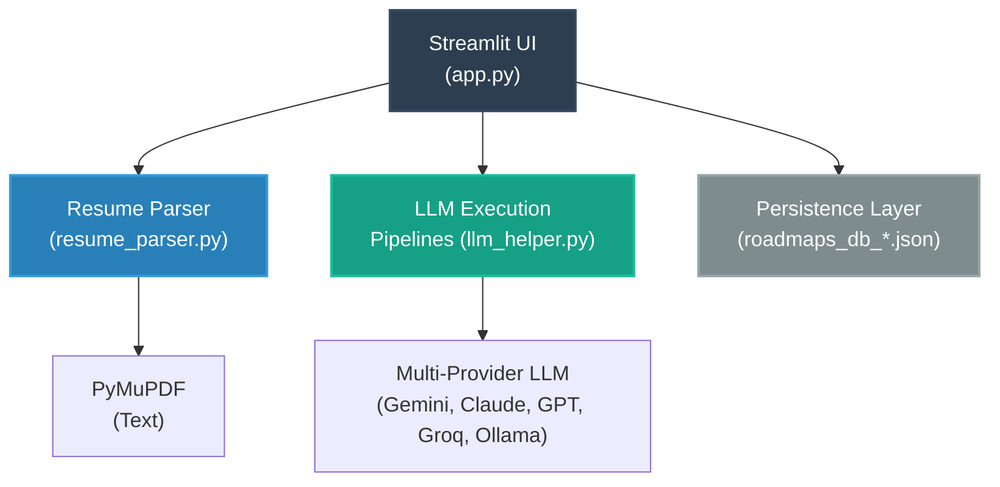

<p align="center">
  
</p>

<h1 align="center">
  SkillWise
</h1>

<p align="center">
  <b>AI-Powered Career Ingestion Engine & 6-Month Hyper-Personalized Learning Path Generator</b>
</p>

<p align="center">
  <a href="https://skillwise-sahaj33.streamlit.app/" target="_blank">
    
  </a>
  &nbsp;
  <a href="https://github.com/sizwinz/SkillWise/stargazers">
    
  </a>
  &nbsp;
  <a href="https://github.com/sizwinz/SkillWise/network/members">
    
  </a>
  &nbsp;
  <a href="LICENSE">
    
  </a>
</p>

<p align="center">
  <a href="#core-features">Features</a> •
  <a href="#architecture--stack">Architecture</a> •
  <a href="#installation--setup">Setup</a> •
  <a href="#configuration">Configuration</a> •
  <a href="#directory-structure">Structure</a> •
  <a href="#license">License</a>
</p>

---

SkillWise is a career transition intelligence application. By parsing engineering resumes or structured LinkedIn datasets and querying state-of-the-art LLM providers, SkillWise conducts programmatic gap detection, runs zero-shot job simulation matching, visualizes progress timelines dynamically, and tracks target-milestone completion natively with local persistence.

---

## Core Features

### 1. Multi-Format Resume Ingestion Engine
* **Native Parsing:** Programmatic text layer extraction from PDF files via PyMuPDF (`fitz`).
* **OCR Fallback Subsystem:** Automatic fallback execution via `pytesseract` to handle scanned or image-based resumes if initial text yields fail validation filters.
* **LinkedIn Data Ingestion:** Explicit dictionary mapping and traversal routines parsing comprehensive LinkedIn profile JSON data exports (including experience schemas, timeframes, and certifications).

### 2. Deep Skill Gap Matrix & Analysis
* **Contextual Goal Extraction:** Zero-shot analysis of high-level targeting statements (e.g., "AI Developer") utilizing LLMs to extract hard/soft skill requirements instantly.
* **Narrative Gap Assessment:** Runs comparative analysis against an ideal candidate profile to point out abstract missing components (e.g., architectural experiences, specific design patterns, or system-level exposures).

### 3. Interactive Roadmap Orchestration
* **Dynamic Gantt Visualizations:** Translates markdown-based temporal learning schedules directly into interactive, color-coded timelines rendered natively via Plotly Express charts.
* **Integrated Checklist & State Syncer:** Tracking logic parsing task lists from roadmaps to map completion flags into local sync routines.

### 4. Job Role Simulation Environment
* **Ad-Hoc Job Description Matching:** Subsystem enabling immediate resume pairing against arbitrary copy-pasted job descriptions to produce clear fit metrics and percentage compatibility ratings.
* **Targeted Remediation Plans:** Generates targeted 6-month plans designed around neutralizing deficiencies found in a given job description.

### 5. Persistent Session Management & State Storage
* **Local DB State Layer:** Lightweight filesystem tracking layer using session IDs computed over a user's resume, goal, and role variations to auto-reconcile state indices.
* **Sidebar History Workspace:** Context management dashboard allowing search, active roadmap pinning, JSON exports, and continuation loading.

---

## Architecture & Stack

SkillWise uses an asynchronous, modular design separating front-end client rendering states from model interface layers and systemic document tools:



* **Frontend Framework:** Streamlit (Layout engine, Session state controller).
* **AI Core Orchestration Platform:** Unified `llm_helper.py` supporting:
  * Google Gemini
  * OpenAI (ChatGPT)
  * Anthropic (Claude)
  * Groq
  * Ollama (Local)
  * OpenRouter
  * xAI (Grok)
  * Mistral
* **Visualization Layer:** Plotly Express + Pandas (Time-delta processing engines tracking duration descriptors).
* **Document Exporters:** ReportLab Custom Canvas Engine.

---

## Installation & Setup

### Prerequisites
* **Python 3.11** or **Python 3.13**
* **Tesseract OCR Engine** binaries configured in the execution environment system path.

### 1. Clone the Repository
```bash
git clone https://github.com/sizwinz/SkillWise.git
cd SkillWise
```

### 2. Install System Dependencies (Required for Scanned PDF Handling)

* **Debian/Ubuntu Linux:**
```bash
sudo apt update
sudo apt install -y tesseract-ocr
```

* **macOS (via Homebrew):**
```bash
brew install tesseract
```

* **Windows:**
Download and run the windows executable distribution installer from the official [UB-Mannheim Tesseract Repository](https://github.com/UB-Mannheim/tesseract/wiki). Ensure the binary path is correctly included inside your Environment variables `PATH`.

### 3. Install Python Package Dependencies
```bash
pip install -r requirements.txt
```

---

## Configuration

Set up configuration settings by creating a `.env` environment variables block inside your directory root path:

```env
GEMINI_API_KEY=your_actual_google_gemini_api_key_here
```

*Alternatively, the application sidebar provides a secure configuration utility selectbox allowing direct manual entry of API keys for Google Gemini, OpenAI, Anthropic Claude, Groq, Mistral, xAI Grok, or Ollama URL straight into the context lifecycle cache at runtime.*

### Launching the Application
Execute the application local server:
```bash
streamlit run app.py
```

---

## Directory Structure

```
SkillWise/
├── .devcontainer/
│   └── devcontainer.json    # Standard container-orchestrated runtime definitions
├── .streamlit/
│   └── config.toml          # Native Streamlit theme properties
├── screenshots/
│   ├── upload.png           # User onboarding / application capture panels
│   └── roadmap.png          # Visual interactive dashboard timelines
├── app.py                   # Central Streamlit entrypoint & component pipeline
├── llm_helper.py            # Unified LLM provider completions and models fetcher
├── resume_parser.py         # Fitz extraction logic & Tesseract scanning engines
├── goal_analyzer.py         # Target role & token parsing validation modules
├── roadmap_generator.py     # Retry-backoff logic calling LLM generation routines
├── smart_gap_analyzer.py    # Zero-shot resume deficiency scoring pipelines
├── skills_data.json         # Fallback taxonomy lists tracking static tech skills
├── style.css                # Custom UI styling configurations
├── requirements.txt         # Primary pinned setup package dependency lists
└── packages.txt             # Mandatory platform-layer binary installation targets
```

---

## License

Distributed directly under the terms of the open-source **MIT License**. Check out the [`LICENSE`](https://www.google.com/search?q=LICENSE) verification file for detailed phrasing constraints.

---
